# Ječná Forum – API & Deployment dokumentace (v1)

> Cíl: co nejjednodušší onboarding pro celý tým (FE, sysadmin/VPS, dokumentarista, scrum master) + jedno místo pro všechny informace.

---

## Obsah
- [1. Celková dokumentace](#1-celkova-dokumentace)
  - [1.1 Co aplikace dělá](#11-co-aplikace-dela)
  - [1.2 Tech stack](#12-tech-stack)
  - [1.3 Autentizace](#13-autentizace)
  - [1.4 Datový model](#14-datovy-model)
  - [1.5 Diagramy](#15-diagramy)
  - [1.6 Konvence API](#16-konvence-api)
- [2. Pro VPS admina](#2-pro-vps-admina)
- [3. Pro dokumentaristu](#3-pro-dokumentaristu)
- [4. Pro FE developera](#4-pro-fe-developera)
- [5. Pro Scrum mastera](#5-pro-scrum-mastera)

---

<a id="1-celkova-dokumentace"></a>
# 1. Celková dokumentace

<a id="11-co-aplikace-dela"></a>
## 1.1 Co aplikace dělá
Ječná Forum je jednoduché fórum:
- uživatel si vytvoří účet **jen pomocí veřejného `username`**
- systém mu vygeneruje **unikátní heslo** (uživatel si ho musí uložit)
- přihlašování probíhá **jen pomocí hesla**
- přihlášení vrací **API token** (Laravel Sanctum)
- uživatel může vytvářet / upravovat / mazat své posty a komentáře
- čtení postů a komentářů je veřejné

> Role v týmu a očekávání (sysadmin/dokumentarista/scrum master) vychází ze zadání projektu.

---

<a id="12-tech-stack"></a>
## 1.2 Tech stack
- Backend: **PHP + Laravel**
- API autentizace: **Laravel Sanctum (Personal Access Tokens)**
- DB: **MySQL**
- Nasazení: VPS (Linux) + web server (Nginx/Apache) + PHP-FPM

---

<a id="13-autentizace"></a>
## 1.3 Autentizace

### 1.3.1 Základní princip
- `username` je **veřejný** identifikátor (zobrazuje se na webu).
- `password` je **tajný klíč** (chová se podobně jako API key).
- Login je **jen podle `password`** → backend nejdřív najde uživatele přes `password_lookup`, a pak ověří heslo přes bcrypt hash.

### 1.3.2 Proč existuje `password_lookup`
Laravel ukládá `password` bezpečně jako hash (bcrypt/argon). Ten hash je **saltovaný**, takže nejde použít pro vyhledání uživatele v DB.

Proto ukládáme i:
- `password_lookup = HMAC_SHA256(password, APP_KEY)`
  - deterministické (stejné heslo → stejný lookup)
  - bez `APP_KEY` ho útočník nedokáže snadno dopočítat

**Login flow:**
1) z requestu vezmeme `password`
2) spočítáme `lookup`
3) najdeme usera přes `where(password_lookup = lookup)`
4) ověříme `Hash::check(password, user.password)`
5) vydáme Sanctum token

### 1.3.3 Token policy (jednoduché pro uživatele)
- **Login vždy zruší všechny staré tokeny** a vydá nový (1 aktivní přihlášení).
- **Logout zruší všechny tokeny**.

---

<a id="14-datovy-model"></a>
## 1.4 Datový model

### 1.4.1 Pravidla mazání (CASCADE)
Požadavek: při smazání uživatele zmizí všechen jeho obsah.
- `users -> posts`: **cascadeOnDelete**
- `users -> comments`: **cascadeOnDelete**
- `posts -> comments`: **cascadeOnDelete**

Cizí klíče nejsou nullable: obsah vždy musí mít autora a vztahy.

### 1.4.2 Validační limity (ochrana proti extrémně dlouhým textům)
- `posts.title`: min 5, max 255
- `posts.body`: min 5, max 8191
- `comments.body`: min 2, max 2000
(Validace probíhá v controllerech.)

---

<a id="15-diagramy"></a>
## 1.5 Diagramy

### 1.5.1 ERD (entitně-relační diagram)


### 1.5.2 Sekvenční diagram – registrace

```mermaid
sequenceDiagram
  participant FE as Frontend
  participant API as Backend API
  participant DB as MySQL

  FE->>API: POST /api/v1/auth/register { username }
  API->>API: vygeneruje password + password_lookup
  API->>DB: INSERT users(username, password(hash), password_lookup)
  DB-->>API: OK
  API->>API: vytvoří Sanctum token
  API-->>FE: 201 { username, password, token }
```


### 1.5.3 Sekvenční diagram – login (jen password)


### 1.5.4 Deployment diagram (jednoduše)


---

<a id="16-konvence-api"></a>
## 1.6 Konvence API
- Base URL: `http://<host>/api/v1`
- JSON request/response
- Auth header pro chráněné endpointy:
  - `Authorization: Bearer <TOKEN>`
- Typické statusy:
  - `200 OK`, `201 Created`, `204 No Content`
  - `401 Unauthorized` (token chybí/neplatný)
  - `403 Forbidden` (není autor)
  - `404 Not Found`
  - `422 Unprocessable Entity` (validace)

---

<a id="2-pro-vps-admina"></a>
# 2. Pro VPS admina

## 2.1 Co musí mít nainstalované
### Na VPS
- Git
- PHP (doporučeno 8.2+) + rozšíření: `mbstring`, `xml`, `curl`, `zip`, `pdo_mysql`
- Composer
- MySQL server
- Web server: Nginx nebo Apache
- (volitelně) Node.js + npm (jen pokud se buildí i FE na serveru)

## 2.2 Postup nasazení (když repo naklonuješ)

### 2.2.1 Klon a instalace
```bash
git clone https://github.com/MrToxc/WA-Scrum-project.git
cd WA-Scrum-project/forum-api-app

composer install --no-dev --optimize-autoloader
cp .env.example .env
php artisan key:generate
```

### 2.2.2 MySQL – vytvoření DB a uživatele
Příklad:
```sql
CREATE DATABASE forum CHARACTER SET utf8mb4 COLLATE utf8mb4_unicode_ci;
CREATE USER 'forum_user'@'localhost' IDENTIFIED BY 'STRONG_PASSWORD';
GRANT ALL PRIVILEGES ON forum.* TO 'forum_user'@'localhost';
FLUSH PRIVILEGES;
```

### 2.2.3 `.env` – minimální nastavení
Uprav v `.env`:
```env
APP_NAME="Jecna Forum"
APP_ENV=production
APP_DEBUG=false
APP_URL=https://your-domain.example

DB_CONNECTION=mysql
DB_HOST=127.0.0.1
DB_PORT=3306
DB_DATABASE=forum
DB_USERNAME=forum_user
DB_PASSWORD=STRONG_PASSWORD
```

> Důležité: `APP_KEY` generuje `php artisan key:generate` a musí zůstat tajný (používá se i pro `password_lookup`).

### 2.2.4 Migrace
```bash
php artisan migrate --force
```

### 2.2.5 Sanctum (pokud by chybělo)
V typickém projektu už je, ale kdyby ne:
```bash
composer require laravel/sanctum
php artisan vendor:publish --provider="Laravel\Sanctum\SanctumServiceProvider"
php artisan migrate --force
```

### 2.2.6 Práva složek
```bash
chmod -R 775 storage bootstrap/cache
chown -R www-data:www-data storage bootstrap/cache
```

### 2.2.7 Web server (rychlý checklist)
- Document root musí mířit na `public/`
- Zapnout PHP-FPM
- HTTPS (Let's Encrypt)
- CORS: povolit doménu FE (pokud běží zvlášť)

## 2.3 Diagnostika
- logy: `storage/logs/laravel.log`
- health check:
  - `GET /api/v1/posts` musí vrátit 200
  - `POST /api/v1/auth/register` musí vrátit 201

---

<a id="3-pro-dokumentaristu"></a>
# 3. Pro dokumentaristu

## 3.1 Co máš zapisovat (prakticky)
Tvoje role v projektu: kontrolovat požadavky vs. skutečný kód + spravovat dokumentaci.

### Checklist pro dokumentaristu
- ✅ Popis produktu: co fórum dělá, pro koho je určené
- ✅ Stakeholdeři + use-cases + požadavky (ID, kategorie, stav)
- ✅ Jak vypadá autentizace (username veřejný, login heslem)
- ✅ Co je `password_lookup` a proč existuje
- ✅ Endpointy + příklady request/response + status kódy
- ✅ ERD + sekvenční diagramy (v této dokumentaci už jsou)
- ✅ Nasazení na VPS: kroky + .env + DB
- ✅ Validace a limity (max délky textů)
- ✅ Mazání (cascade delete): smazání usera smaže vše

### Ověření splnění (validace “kód vs zadání”)
- porovnej routes (`routes/api.php`) s dokumentací
- porovnej controllery a limity validace
- zapiš rozdíly do týmové tabulky a otevři issue

---

<a id="4-pro-fe-developera"></a>
# 4. Pro FE developera

## 4.0 UX filozofie – maximální jednoduchost (KLÍČOVÉ)

Primární cíl projektu je **maximální zapojení uživatelů**.  
Frontend musí být navržen tak, aby interakce byla co nejjednodušší a nejpřímější.

---

### 🔹 Registrace (nejdůležitější část)

Registrace musí být:

- jednokroková  
- okamžitá  
- bez zbytečných formulářů  
- bez vícekrokového procesu  

Uživatel zadá pouze **username** a ihned je registrován.  
Backend vrátí vygenerované heslo – frontend ho musí:

- jasně zobrazit  
- upozornit, že se zobrazí pouze jednou  
- doporučit jeho uložení  

Nesmí vzniknout dojem, že je registrace složitá nebo administrativně náročná.

Cíl: uživatel musí být schopný se zaregistrovat během několika sekund.

---

### 🔹 Přihlášení

Přihlášení musí být snadno dostupné a rychlé.  
Nemá působit složitě ani odrazujícím dojmem.

---

### 🔹 Interakce s obsahem

Stránka musí podporovat okamžitou aktivitu:

- možnost přidat příspěvek musí být vždy snadno dostupná  
- možnost napsat komentář musí být „po ruce“ při čtení komentářů  
- uživatel nesmí složitě hledat, kde může reagovat  

Cílem je minimalizovat tření (friction).  
Čím méně kroků mezi myšlenkou a akcí, tím lépe.

---

### 🔹 Hlavní princip

Pokud je registrace nebo interakce složitá, uživatel odejde.  
Jednoduchost je priorita nad vším ostatním.


## 4.1 Jak se autentizuje FE
- FE drží **token** (např. v memory/store; localStorage jen pokud musíš)
- chráněné requesty posílají:
  - `Authorization: Bearer <TOKEN>`

**Doporučený FE flow:**
1) Registrace → FE dostane `password` a `token`
2) FE zobrazí `password` a donutí uživatele uložit (je to jediné zobrazení)
3) Při startu appky:
   - pokud mám token → zavolám `/auth/me`
   - pokud 200 → user je přihlášen
   - pokud 401 → token smazat a přejít na login

---

## 4.2 Endpointy (v1)

### AUTH
#### POST `/auth/register`
- Body:
```json
{ "username": "tester1" }
```
- 201 Response:
```json
{ "username": "tester1", "password": "<GENERATED>", "token": "<TOKEN>" }
```
- Chyby:
  - 422 (username nevalidní nebo není unique)

#### POST `/auth/login`
- Body:
```json
{ "password": "<GENERATED>" }
```
- 200 Response:
```json
{ "token": "<TOKEN>", "user": { "id": 1, "username": "tester1" } }
```
- Pozn.: login zruší všechny staré tokeny (jen 1 aktivní).

#### POST `/auth/logout` (auth)
- Header: `Authorization: Bearer <TOKEN>`
- 200 Response:
```json
{ "message": "Logged out." }
```

#### GET `/auth/me` (auth)
- Header: `Authorization: Bearer <TOKEN>`
- 200 Response:
```json
{ "id": 1, "username": "tester1" }
```
- 401 pokud token neplatí.

---

### POSTS (čtení veřejné, zápis chráněný)
#### GET `/posts`
- Query: `?per_page=10` (omezeno 10–50)
- 200 Response:
```json
{
  "data": [
    { "id": 1, "title": "...", "body": "...", "comments_count": 0, "user": { "id": 1, "username": "tester1" } }
  ],
  "meta": { "page": 1, "last_page": 1, "per_page": 10, "total": 1 }
}
```

#### GET `/posts/{post}`
- 200 Response:
```json
{ "data": { "id": 1, "title": "...", "body": "...", "comments_count": 3, "user": { "id": 1, "username": "tester1" } } }
```

#### POST `/posts` (auth)
- Body:
```json
{ "title": "Prvni post", "body": "Obsah..." }
```
- 201 Response: `{ "data": <post> }`
- Chyby: 401 / 422

#### PUT `/posts/{post}` (auth + autor)
- 403 pokud nejsi autor

#### DELETE `/posts/{post}` (auth + autor)
- 204 No Content
- Pozn.: smazání postu smaže komentáře (cascade).

---

### COMMENTS
#### GET `/posts/{post}/comments`
- 200 Response:
```json
{ "data": [ { "id": 10, "body": "...", "user": { "id": 1, "username": "tester1" } } ] }
```

#### POST `/posts/{post}/comments` (auth)
- Body:
```json
{ "body": "This is the comment body" }
```
- 201 Response: `{ "data": <comment> }`

#### PUT `/comments/{comment}` (auth + autor)
- 403 pokud nejsi autor

#### DELETE `/comments/{comment}` (auth + autor)
- 204 No Content

---

## 4.3 FE “gotchas” (na co si dát pozor)
- `password` se vrací jen při registraci → FE musí uživateli jasně říct, že si ho má uložit.
- 401 z `/auth/me` znamená: token je pryč (logout / nový login / smazaný účet).
- Po loginu se staré tokeny ruší → pokud má uživatel otevřené 2 prohlížeče, starý se odhlásí.

---

## 4.4 Zobrazení stavu „editováno“

API vrací pouze čas vytvoření a čas poslední úpravy položky:

- `created_at` – čas vytvoření
- `updated_at` – čas poslední úpravy

Frontend určuje, zda byl post nebo komentář editován, porovnáním těchto hodnot.

### Pravidlo
Položka se považuje za **editovanou**, pokud platí:

`updated_at - created_at > 5 sekund`

Pokud je rozdíl ≤ 5 sekund, položka se považuje za needitovanou (tolerance kvůli časovému zápisu při vytvoření).

### Příklad
- created_at: 12:00:00, updated_at: 12:00:03 → needitováno  
- created_at: 12:00:00, updated_at: 12:00:12 → editováno (zobrazit „Edited“)

### Poznámky
- Pravidlo platí pro posty i komentáře.
- Pokud `updated_at` chybí nebo je null, položka se považuje za needitovanou.
- Časy jsou očekávány ve stejném formátu (ISO 8601).

---

<a id="5-pro-scrum-mastera"></a>
# 5. Pro Scrum mastera

## 5.1 Co sledovat
Scrum master eviduje práci, hlídá plán a tabulky.

### Doporučená týmová tabulka (minimum)
- Backlog item (požadavek ID)
- Owner (kdo to dělá)
- Status (TODO / Doing / Review / Done)
- Odhad (h)
- Skutečnost (h)
- Link na PR / commit
- Poznámky (blokery, rizika)

## 5.2 Rizika (na která dát pozor)
- Login jen heslem = heslo je tajný klíč → řešit UX (zobrazení jen jednou) a případně proces “ztratil jsem heslo”.
- Bez paginace komentářů může růst payload (zatím ok pro školní projekt).
- VPS: bezpečnost `.env`, DB hesla, HTTPS.

---

<a id="quickstart-pro-lokalni-vyvoj"></a>
## Quickstart pro lokální vývoj (pro kohokoliv)

### Požadavky
- PHP + Composer
- MySQL
- (volitelně) Node/npm

### Kroky
```bash
git clone https://github.com/MrToxc/WA-Scrum-project.git
cd WA-Scrum-project/forum-api-app
composer install
cp .env.example .env
php artisan key:generate

# nastav DB v .env (DB_DATABASE, DB_USERNAME, DB_PASSWORD)
php artisan migrate

php artisan serve
```

Test:
- `GET http://127.0.0.1:8000/api/v1/posts`

---

## Appendix: doporučené HTTP headery v Postmanu
- `Accept: application/json`
- `Content-Type: application/json`
- `Authorization: Bearer <TOKEN>` (chráněné endpointy)
