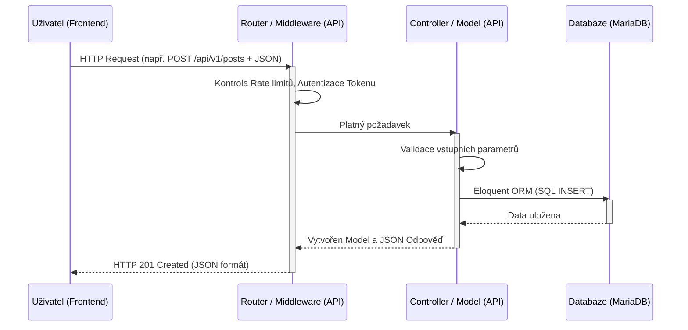
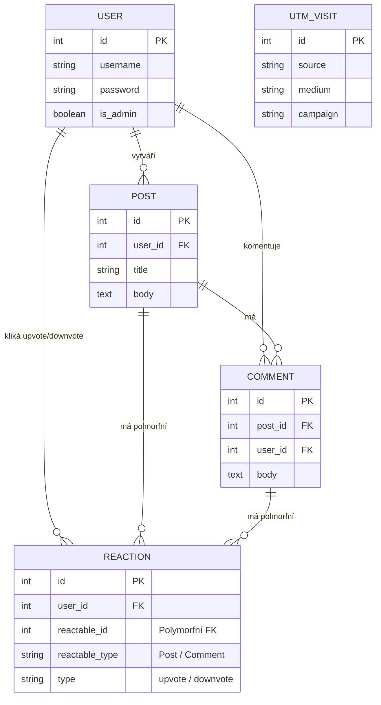

# Kapitola: 6.5. Architektura systému

Architektura našeho softwarového řešení popisuje základní strukturu webové aplikace, její klíčové vrstvy, oddělení jednotlivých odpovědností a způsob, jakým mezi sebou komunikují. Architektura je navržena plně v souladu se zadanými požadavky na modularitu, budoucí rozšiřitelnost a snadnou údržbu.

---

## 1. Hlavní komponenty systému

Aplikace je orientována do vrstvené Client-Server architektury a rozděluje se na tyto hlavní celky:

1. **Frontend – Uživatelské rozhraní aplikace**
   Běží čistě na straně klienta (webový prohlížeč). Je to tzv. "hloupá" komponenta, která nevykonává žádnou složitou business logiku ani přímé dotazy do databáze. Její primární úlohou je vykreslení grafického rozhraní (UI) a reakce na akce uživatele tím, že odesílá HTTP dotazy.
2. **Backend API – Logika aplikace a zpracování požadavků**
   Oddělená serverová aplikace (vytvořená ve frameworku Laravel PHP), která slouží jako jediné vstupní místo k datům. Má na starosti směrování požadavků (routy jako např. `/api/v1/posts`), ověřování identit (autentizace pomocí tokenů Laravel Sanctum), kontrolu vstupních dat a ochranu proti zneužití (Rate Limiting). Po validaci provede předepsanou logiku.
3. **Databáze – Ukládání dat systému**
   Relační SQL databázový management systém pro trvalé ukládání. Samotná databáze je izolovaná a nelze se do ní připojit z venčí (např. přímo z Frontendu); jedinou cestou je zpracovaný příkaz přes Backend API.

---

## 2. Použité technologie a komunikační rozhraní

- **Komunikace (Frontend <-> Backend):** Architektura využívá čistý styl **REST API**. Komunikace probíhá přes protokol **HTTP(S)**. Formátem datových odpovědí i příchozích zpráv ve tělě požadavků (při zakládání příspěvků a komentářů) je standardní formát **JSON**. Všechny dotazy chráněné autentizací musí v hlavičce nést klíč `Authorization: Bearer <TOKEN>`.
- **Backendová logika:** PHP (Laravel) s využitím standardního návrhového vzoru MVC, kde API je složeno z Controllerů, které zpracovávají byznys logiku (např. `PostController`, `AuthController`) a Modelů (tříd zastupujících strukturu z databáze).
- **Komunikace (Backend <-> Databáze):** Kód využívá k SQL komunikaci výřečný ORM systém Eloquent, a data jsou ukládána do systému **MariaDB**.

---

## 3. Architektonický diagram systému a datové toky
Datový tok typicky začíná akcí uživatele, následuje požadavek na API, kde middleware zkontroluje Rate Limity a Token udržituje relaci. Po proběhnutí logiky se odešle transakce do DB a vrací se odpověď s JSON daty.

---

## 4. Datový model
Základní modelová data aplikačního jádra se skládají z několika jasně oddělených entit strukturovaných relačními vazbami. Rozložení ukazuje tento ERD (Entitně relační diagram):

**Základní entity:**
- `User`: Entita uživatele uchovávající přihlašovací údaje (zahashovaná hesla) a definici oprávnění administrátora.
- `Post`: Hlavní předmět uživatelské interakce ve fóru, obsahuje metadata a textový obsah (tělo příspěvku).
- `Comment`: Zpětná vazba k příspěvkům – vždy striktně navázaná na jeden konkrétní `Post` a autora `User`.
- `Reaction`: Polymorfní záznam pro označení lajků. Stejná entita slouží jak pro ohodnocení příspěvku (Post), tak komentáře (Comment), což ušetřilo obrovskou duplikaci tabulek v databázi. Systém je typu "přepínač" (uživatel může na stejnou entitu reagovat vždy pouze jednou instancí upvote/downvote).
- `UtmVisit`: Analytická tabulka postavená mimo klasické vztahy, určená pro logování a vyhodnocování marketingového dosahu projektu pomocí sledování UTM parametrů odkazů.

---

## 5. Vztah architektury k případným požadavkům
Rozvržení do výše zobrazené moderní architektury zajišťuje naplnění i těžších kvalitativních standardů pro software:
- **Modularita:** Na úrovni kódu je striktně oddělena prezentační vrstva (ta leží u klienta) od logické (Backendu). Na samotném Backendu pak platí přísné izolování Controllerů od struktury Modelů. Příkladem silné reusability/modularity jsou např. zmíněné Polymorfní reakce.
- **Rozšiřitelnost:** Zvolený styl REST API umožňuje velice lehký vývoj libovolného nového klienta v budoucnosti (např. dedikovaná mobilní frontend aplikace, protože API posílá čistý JSON nezávisle na rozhraní). Databáze disponuje migračními scripty a snadno může nasadit nové datové struktury.
- **Snadná udržovatelnost (Maintainability):** Centrální registrace přístupových cest (vše bezpečně vedeno přes `routes/api.php`), jednoznačně izolované logovací middlewares na ochranu serveru (Throttle rate limits – 5 requestů u registrace, až po 60 requestů u public čtení za minutu) nebo automatické chování cascade-delete mazání vztahových záznamů. Vše zaručuje, že údržba, debugování a napojování nových požadavků bude maximálně spolehlivé. Dobrá architektura je tak už nyní připravena na případný budoucí rozvoj a zjednodušuje agendu testování. Tímto je vztah definovaných požadavků v plném souladu s implementací a je doložena dohledatelnost trasovatelnosti (Traceability).
